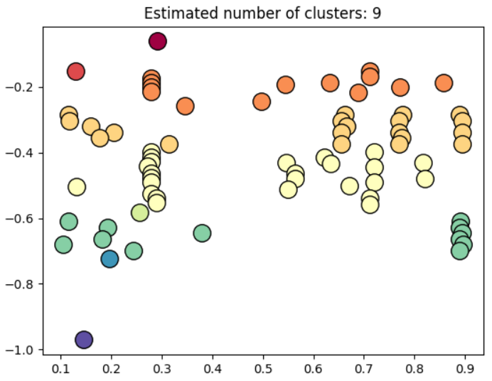
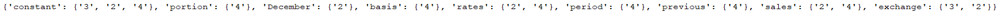
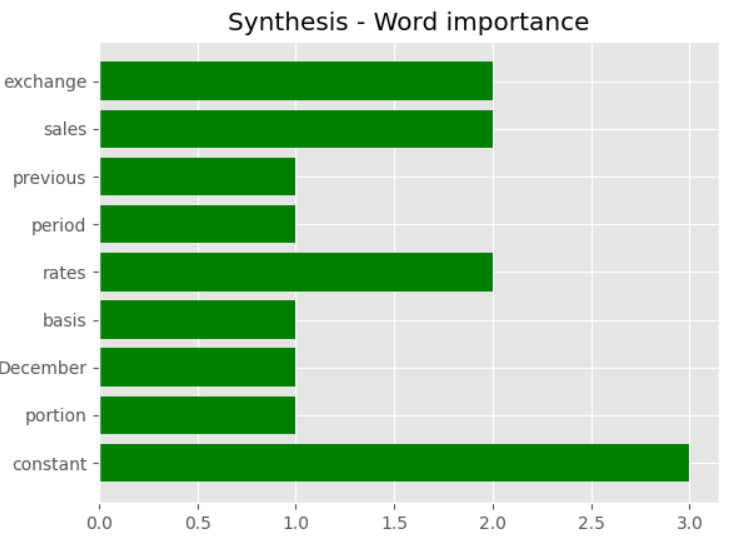

# UnsupervisedNaturalLanguageProcessing
Clusterised natural language processing package
### Applications : 
- text analysis based algorithmic trading strategies
- text sentiment analysis based trading strategies

## Description
Construction of a parcimonious and accurate automatic text understanding

## Content
- Json data processing
- Text clustering layer
- Text processing layer
- Unit testing layer

## Results 
We are able to clusterise accuratly the text regions on a sample financial text

To enable a parcimonious automatic file understanding in each relevant cluster

And then to synthesize the overall information using a hierarchical criterion

